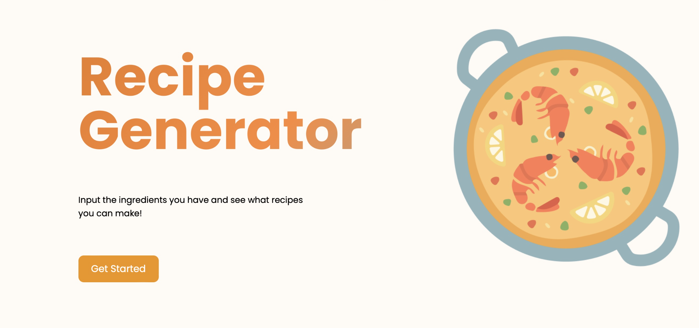

# MealCart
AI Recipe and Grocery List Generator

A full-stack MERN application that helps users discover recipes and generate intelligent grocery lists using AI assistance.

## Features

- **Recipe Discovery**: Search for recipes using ingredients you have
- **Recipe Management**: Save, organize, and rate your favorite recipes
- **Smart Grocery Lists**: Generate consolidated grocery lists from multiple recipes
- **AI Assistance**: Get cooking tips, ingredient substitutions, and meal planning help
- **User Authentication**: Secure user accounts with JWT authentication

## Tech Stack

### Backend
- **Node.js** & **Express.js** - Server framework
- **MongoDB** & **Mongoose** - Database and ODM
- **JWT** - Authentication
- **Spoonacular API** - Recipe data
- **Google Gemini AI** - AI assistance

### Frontend
- **React.js** - Frontend framework
- **Material-UI** or **Tailwind CSS** - UI components
- **Axios** - HTTP client
- **React Router** - Navigation

## Project Structure

```
MealCart/
├── backend/          # Node.js Express API
│   ├── models/       # Database models
│   ├── routes/       # API routes
│   ├── middleware/   # Custom middleware
│   └── server.js     # Main server file
├── frontend/         # React application
└── README.md         # Project documentation
```

## Quick Start

### Backend Setup

1. Navigate to the backend directory:
   ```bash
   cd backend
   ```

2. Install dependencies:
   ```bash
   npm install
   ```

3. Set up environment variables:
   ```bash
   cp .env.example .env
   # Edit .env with your configuration
   ```

4. Start the server:
   ```bash
   npm run dev
   ```

The backend API will be running on `http://localhost:5001`

### Frontend Setup

```bash
cd frontend
npm install
npm start
```

The frontend will be running on `http://localhost:3000`

## API Endpoints

- **Authentication**: `/api/auth/register`, `/api/auth/login`
- **Recipes**: `/api/recipes/search`, `/api/recipes/save`
- **Grocery Lists**: `/api/grocerylist/generate`
- **AI Assistance**: `/api/gemini/suggest`

## Environment Variables

Create a `.env` file in the backend directory:

```env
MONGODB_URI=your_mongodb_connection_string
JWT_SECRET=your_jwt_secret_key
SPOONACULAR_API_KEY=your_spoonacular_api_key
GEMINI_API_KEY=your_gemini_api_key
PORT=5001
```

## Contributing

1. Fork the repository
2. Create a feature branch
3. Make your changes
4. Test thoroughly
5. Submit a pull request

## License

MIT License - see LICENSE file for details
